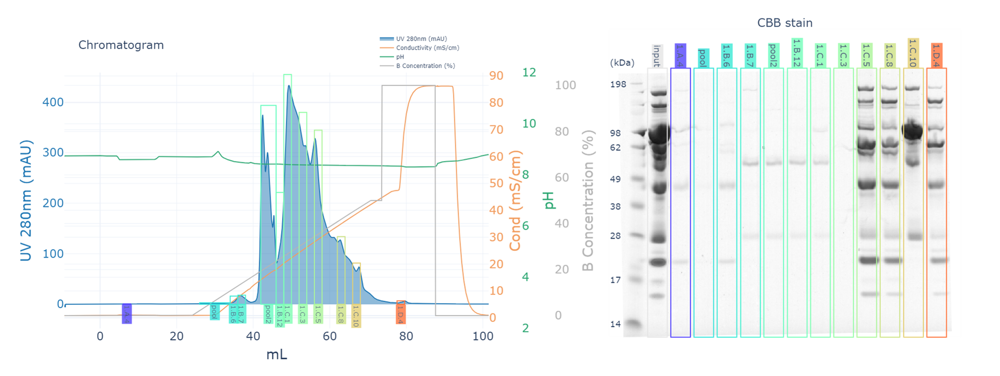
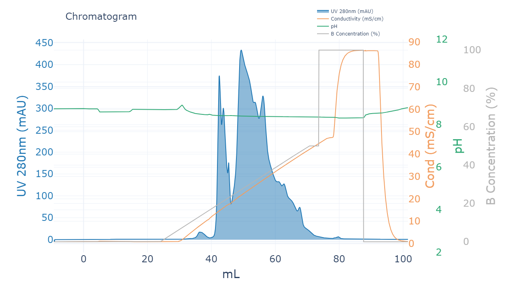
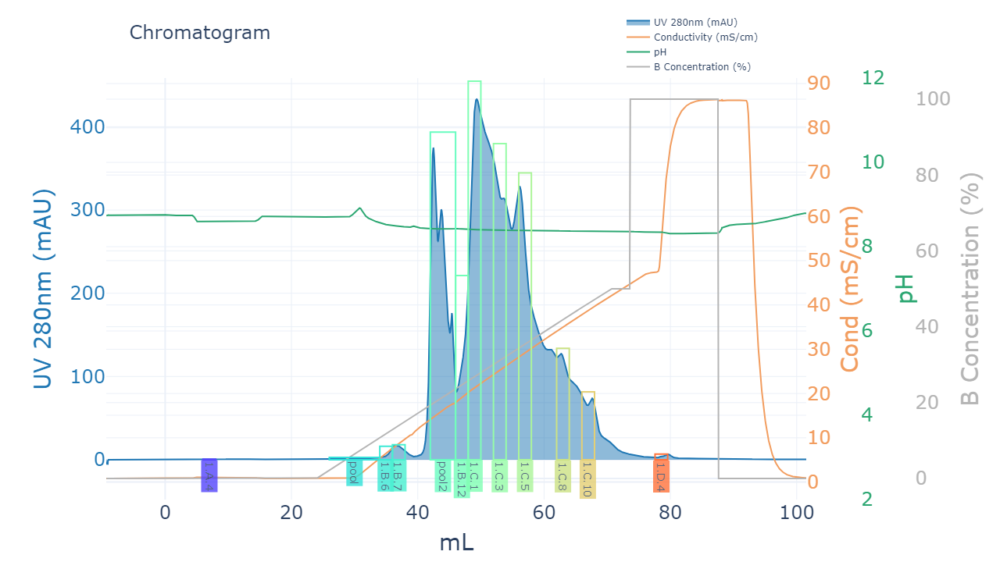
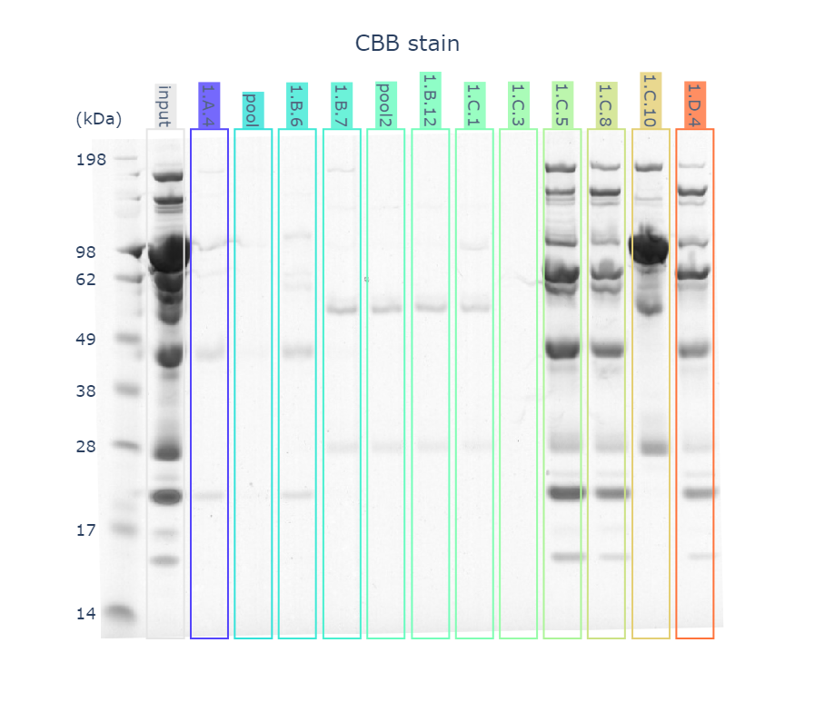

# proteovis

<!-- # Short Description -->

1. pycorn: extract data (zip) from ÄKTA/UNICORN and create chromatograms plotly.
2. pypage: Annotate SDS-PAGE images, automatically input marker size and add lane information.
3. combine these two together to visualize the fractions and lanes connected in AKTA.



<!-- # Badges -->

[](https://github.com/Tsuchihashi-ryo/PyCORN/issues)
[](https://github.com/Tsuchihashi-ryo/PyCORN/network/members)
[](https://github.com/Tsuchihashi-ryo/PyCORN/stargazers)
[](https://github.com/Tsuchihashi-ryo/PyCORN/)
[](https://github.com/Tsuchihashi-ryo/PyCORN/)


# install

```
!git clone git@github.com:Tsuchihashi-ryo/PyCORN.git

%cd PyCORN
!pip install .
```

# Demo
```python
import proteovis as pv

data = pv.pycorn.load_uni_zip("/content/PyCORN/samples/sample.zip")

df = pv.pycorn.utils.get_series_from_data(data,["UV 1_280","UV 2_254","Cond","pH","Conc B","Run Log",'Fractions'],)

fig = pv.graph.unicorn_ploty_graph(df)
fig.show() 
```


```python
frac_df = pv.pycorn.utils.get_fraction_rectangle(df)

frac_df = pv.pycorn.utils.pooling_fraction(frac_df,["1.B.2","1.B.3","1.B.4","1.B.5"])
frac_df = pv.pycorn.utils.pooling_fraction(frac_df,["1.B.10","1.B.11"],name="pool2")


cbb_list = [
            "marker",
            "input",
            "1.A.4",
            "pool",
            "1.B.6",
            "1.B.7",
            "pool2",
            "1.B.12",
            "1.C.1",
            "1.C.3",
            "1.C.5",
            "1.C.8",
            "1.C.10",
            "1.D.4",
            ]
cbb_frac_df = frac_df[frac_df["Fraction_Start"].isin(cbb_list)]


palette = sns.color_palette("rainbow", len(frac_df))

fig2,use_color_palette = pv.graph.annotate_fraction(fig,frac_df,palette=palette,annotations=cbb_list)
fig2.show() 
``` 


```python
use_color_palette["input"] = (0.9,0.9,0.9)

cbb = pv.pypage.PageImage("/content/PyCORN/samples/cbb.jpg",lane_width=50)
cbb.annotate_lanes(cbb_list)
cbb.check_image()

fig = cbb.annotated_imshow(use_color_palette,rectangle=True)
fig.show()

marker = cbb.get_lane(name="marker",start=0)
marker = pv.pypage.Marker(marker)
marker.check()

marker.annotate([198,"","",98,62,"",49,38,28,"","",17,14])
pv.pypage.write_marker(fig,marker)
```



# Contributors

- [pyahmed](https://github.com/pyahmed)
- [Tsuchihashi-ryo](https://github.com/Tsuchihashi-ryo)
- [wackywendell](https://github.com/wackywendell)

<!-- CREATED_BY_LEADYOU_README_GENERATOR -->
